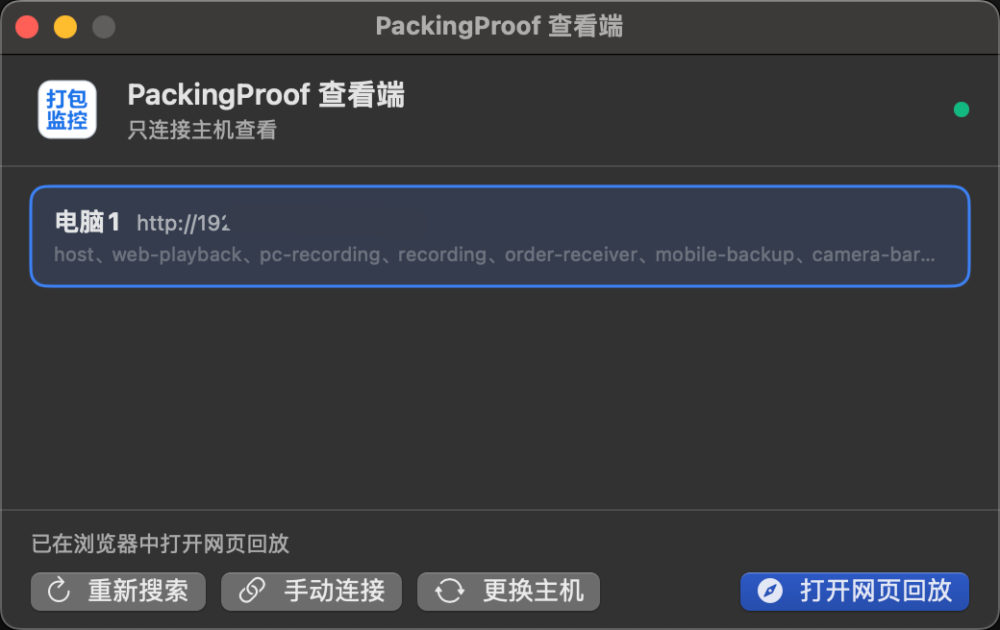

# PackingProof MacViewer

PackProof（PackingProof）的 macOS 查看端，对应桌面版第四种用途“只连接主机查看”：不录像、不做保存主机，只负责在局域网中发现 Windows 保存主机，并用系统默认浏览器打开主机的网页回放页面。

## 界面截图



## 功能

- 自动搜索同一局域网内的 PackingProof 保存主机
- 手动连接：支持 `主机IP:端口` 或带 `?key=` 的完整连接链接
- 记住上次连接的主机，启动时优先验证
- 一键用系统默认浏览器打开网页回放（搜索、播放、剪辑下载都在主机网页里完成）

## 构建与运行

依赖 macOS 13+ 与 Xcode 15+（Swift 5.9+），不需要安装其他工具：

```bash
swift build          # 编译
swift test           # 单元测试
./scripts/build-app.sh   # 生成 dist/PackingProofViewer.app
open dist/PackingProofViewer.app
```

`build-app.sh` 默认使用本机的 `Developer ID Application` 证书签名，并开启 Hardened Runtime。只在当前机器做本地自测时，也可以显式使用临时签名：

```bash
SIGN_IDENTITY=- ./scripts/build-app.sh
```

也可以用 Xcode 打开 `Package.swift` 直接运行调试。

## 发布与安装（GitHub Release）

首次发布前需要在本机准备 Apple 公证凭据：

```bash
xcrun notarytool store-credentials "PackingProofNotary" \
  --apple-id "你的 Apple ID" \
  --team-id "你的 Team ID" \
  --password "App 专用密码"
```

本机签名证书名称保存在被 Git 忽略的 `scripts/signing.env` 中。首次配置请执行：

```bash
cp scripts/signing.env.example scripts/signing.env
```

然后编辑 `scripts/signing.env`，把 `SIGN_IDENTITY` 替换为本机证书全名。

然后执行打包脚本：

```bash
./scripts/package-release.sh 0.0.2
```

脚本会依次完成：

1. 编译 release 版本
2. 使用 `Developer ID Application` 签名 `.app` 并开启 Hardened Runtime
3. 生成 `PackingProofViewer_v0.0.2_macOS.dmg`
4. 签名 DMG
5. 提交 Apple 公证并等待结果
6. 公证通过后钉入票据
7. 生成 DMG 的 `.sha256` 校验文件

发布时把 `dist/PackingProofViewer_v0.0.2_macOS.dmg` 上传到 GitHub Release，并附上 `.sha256` 校验值。

安装方式：

1. 打开 DMG
2. 把 `PackingProofViewer.app` 拖入“应用程序”
3. 双击运行；该版本已通过 Apple 公证，正常情况下不会出现“无法验证的开发者”提示

## 范围说明

- 不包含录像、保存主机、备份/NAS、订单联动、退款拦截等功能
- 不改动 Windows 主机端；协议契约见 [NOTICE.md](NOTICE.md)
- 已支持 Developer ID 签名与 Apple 公证，可分发给其他 Mac

## 许可证

AGPL-3.0，详见 [LICENSE](LICENSE)。本仓库是对 PackingProof-Desktop 的移植，版权与协议来源见 [NOTICE.md](NOTICE.md)。
